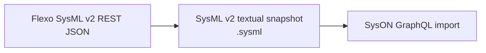
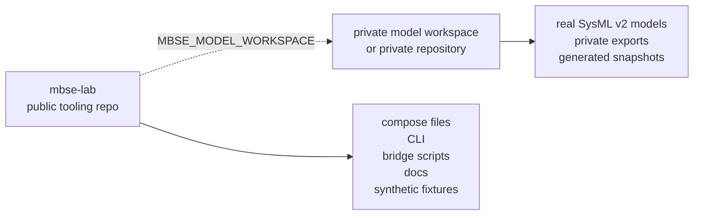

# SysML v2 Local Lab Kit

[](https://github.com/cosgroma/mbse-lab/community)
[](https://github.com/cosgroma/mbse-lab/actions/workflows/ci.yml)
[](https://github.com/cosgroma/mbse-lab/actions/workflows/documentation.yml)
[](LICENSE)
[](pyproject.toml)
[](https://github.com/cosgroma/mbse-lab)

This repo is a reusable local lab kit for starting SysML v2 work without making
this repo the home for the models themselves. It provides:

- OpenMBEE Flexo MMS as the graph-backed model repository and SysML v2 API service.
- Eclipse SysON as a graphical open-source SysML v2 editor.
- A bridge script that exports Flexo SysML v2 REST data, renders a `.sysml`
  textual snapshot, and imports it into SysON.

The current integration path is intentionally file/text based:



SysON and Flexo are separate repository stacks. Treat Flexo as the durable
repository path for API-driven experiments, and use SysON for graphical review or
editing of imported SysML v2 textual content.

## Five-Minute Quickstart

From a fresh checkout, use the CLI-first path and keep generated model artifacts
outside this tooling repo:

```bash
make install-cli
mbse-lab bootstrap --dry-run --model-workspace ~/work/my-private-models
mbse-lab bootstrap --model-workspace ~/work/my-private-models
export MBSE_MODEL_WORKSPACE=~/work/my-private-models
mbse-lab smoke first-use --json-output
mbse-lab share-check
```

Expected result: bootstrap prints the local Flexo and SysON URLs, the smoke
workflow reports `"status": "passed"` with Flexo/SysON IDs and generated
artifact paths under `$MBSE_MODEL_WORKSPACE/exports/`, and `share-check` passes.
Use `mbse-lab first-model "My First Model"` when you want to create just the
example model without the full smoke workflow.

## Which Command Should I Run?

| Goal | Primary command | Notes |
| --- | --- | --- |
| Install the CLI | `make install-cli` | Then run `mbse-lab --help`. |
| First setup | `mbse-lab bootstrap --model-workspace ~/work/my-private-models` | Creates env files, starts services, waits for readiness, and prints next steps. |
| Preview first setup | `mbse-lab bootstrap --dry-run --model-workspace ~/work/my-private-models` | No files, containers, or projects are changed. |
| Check environment | `mbse-lab doctor` | Use `mbse-lab doctor --fix` for low-risk local fixes. |
| Start services | `mbse-lab services up` | Waits for selected service APIs by default. |
| Stop services | `mbse-lab services down` | Keeps persisted service data. |
| Create demo model | `mbse-lab first-model "My First Model"` | Creates one Flexo project and imports it into SysON. |
| Prove first-use path | `mbse-lab smoke first-use --json-output` | Starts services, creates/imports a disposable model, and writes a report. |
| Bridge existing model | `mbse-lab bridge run <flexo-project-id>` | Requires a target SysON project and namespace today. |
| Collect diagnostics | `mbse-lab diagnostics` | Use after service failures. |
| Generate report | `mbse-lab report` | Writes Markdown, HTML, and JSON under `reports/latest/`. |
| Clean generated local output | `mbse-lab cleanup --dry-run` | Remove reports, diagnostics, runs, and temp output after previewing. |
| Before sharing | `mbse-lab share-check` | Blocks common private data and credential leaks. |

Direct `python3 scripts/...` and `docker compose ...` commands remain documented
below for advanced inspection and manual recovery. Prefer `mbse-lab` commands
for routine setup, service lifecycle, bridge, diagnostics, and safety checks.

## Tooling Repo, Not Model Repo

Use this repo for the container deployment, setup scripts, bridge workflow,
diagnostics, documentation, and public synthetic fixtures. Keep real SysML v2
models in a separate private workspace or private repository.

Recommended layout:



```text
~/work/sysmlv2-lab/             this shared tooling repo
~/work/my-private-models/       private model workspace or private repo
```

Set `MBSE_MODEL_WORKSPACE` when you want generated bridge artifacts to default
outside this repo:

```bash
export MBSE_MODEL_WORKSPACE=~/work/my-private-models
```

With that variable set, `flexo-export`, `render-sysml`, and `flexo-to-syson`
write generated artifacts under `$MBSE_MODEL_WORKSPACE/exports/` unless you pass
explicit `--output` or `--output-dir` paths. See the
[private model workspace guide](docs/user-guide/private-model-workspaces.md) for
the full boundary.

## Layout

| Path | Purpose |
| --- | --- |
| [deploy/flexo-mms/](deploy/flexo-mms/README.md) | Flexo MMS Docker Compose environment. |
| [deploy/syson/](deploy/syson/README.md) | SysON Docker Compose environment. |
| [deploy/view-editor/](deploy/view-editor/README.md) | Experimental OpenMBEE View Editor compatibility probe. |
| [deploy/view-editor-5/](deploy/view-editor-5/README.md) | Experimental source-built View Editor 5.x compatibility probe. |
| [docs/index.md](docs/index.md) | Documentation landing page and task router. |
| [docs/user-guide/](docs/user-guide/cli.md) | CLI, release, and private workspace guidance. |
| [docs/lab/](docs/lab/flexo-syson-bridge.md) | Local lab operations, bridge behavior, and harness notes. |
| [docs/lab/view-editor-flexo-experiment.md](docs/lab/view-editor-flexo-experiment.md) | View Editor compatibility evidence. |
| [docs/methodology/](docs/methodology/sysml-v2-verification-model-setup.md) | Reusable SysML v2 setup and transformation guidance. |
| [docs/model-specs/](docs/model-specs/rf-link-budget.md) | General-purpose model specifications. |
| [docs/plans/](docs/plans/README.md) | Active and completed execution plans. |
| [exports/](exports/README.md) | Curated publishable example exports only. |
| [WORKFLOW.md](WORKFLOW.md) | Repo-owned workflow contract for agent work. |
| `scripts/flexo_mms_env.py` | Flexo environment manager. |
| `scripts/flexo_syson_bridge.py` | Flexo/SysON bridge and helper CLI. |

## Requirements

- Docker with the Compose plugin
- Python 3.10+
- Hatch for reproducible Python tooling and MkDocs environments
- `curl` and `jq` are useful for inspection, but not required by the Python
  scripts

No Python packages are required for the scripts; they use the standard library.

## Documentation Site

The Markdown documentation under `docs/` is organized for MkDocs. Build the site
through the Hatch-managed docs environment:

```bash
make docs-build
```

Release steps are documented in the
[release process](docs/user-guide/release-process.md).

Serve it locally while editing:

```bash
make docs-serve
```

## CLI

Install the local CLI in editable mode:

```bash
make install-cli
```

Install directly from GitHub when you do not need an editable checkout:

```bash
python3 -m pip install "git+https://github.com/cosgroma/mbse-lab.git"
```

Then inspect the available commands:

```bash
mbse-lab --help
```

Print shell completion setup:

```bash
mbse-lab completion bash
```

Start with file setup and the environment doctor:

```bash
mbse-lab init --model-workspace ~/work/my-private-models
mbse-lab doctor
mbse-lab doctor --fix
```

The CLI is the primary user-facing command surface for Flexo, SysON, bridge,
diagnostics, and deployment-verification workflows. The legacy `scripts/*.py`
entry points remain available as compatibility and maintainer tools. The
Flexo/SysON bridge implementation lives in `mbse_lab.bridge` package modules,
with `scripts/flexo_syson_bridge.py` kept as a compatibility wrapper.

For first use, run the guided bootstrap:

```bash
mbse-lab bootstrap --model-workspace ~/work/my-private-models
```

Bootstrap starts Flexo and SysON, then waits for the Flexo SysML v2 projects API
and SysON web UI before continuing.

Use `mbse-lab init` when you only want to generate local env files and optional
workspace scaffolding without starting containers.

Preview the bootstrap without changing files or starting containers:

```bash
mbse-lab bootstrap --dry-run --model-workspace ~/work/my-private-models
```

After setup, routine service lifecycle commands are available through the CLI:

```bash
mbse-lab services up
mbse-lab services logs
mbse-lab services down
```

`mbse-lab services up` waits for selected service APIs by default. Use
`--no-wait` to return immediately after container startup.

Create a tiny first model after the services are running:

```bash
mbse-lab first-model "My First Model"
```

That command creates a Flexo project with one package, exports and renders the
model, creates a SysON review project, imports the rendered SysML text, and
prints the resulting project IDs and artifact paths.

Or run the first-use proof workflow, which starts services, initializes Flexo,
creates/imports a disposable model, and writes the lab report:

```bash
mbse-lab smoke first-use --json-output
```

Routine bridge operations are also available through the CLI:

```bash
mbse-lab flexo list
mbse-lab syson list
mbse-lab bridge run <flexo-project-id> \
  --syson-project-id <syson-project-id> \
  --namespace-id <syson-root-package-id>
```

Before sharing or publishing the tooling repo, run:

```bash
mbse-lab share-check
```

It checks for accidentally tracked runtime env files, service data, generated
private exports, run logs, diagnostics bundles, and known local secret patterns.

Generate a static local lab report:

```bash
mbse-lab report
```

The report writes Markdown, HTML, and JSON snapshots under `reports/latest/`.

Remove generated local reports, diagnostics, run logs, and temporary output:

```bash
mbse-lab cleanup
```

Use `mbse-lab cleanup --dry-run` to preview cleanup targets first.

## Credentials

Runtime credential files are intentionally ignored by git:

```text
deploy/flexo-mms/.env
deploy/flexo-mms/env/*.env
deploy/syson/.env
```

Publishable templates are committed as `.example` files. Flexo runtime env files
are generated by:

```bash
mbse-lab init
```

Rotate local Flexo credentials at any time:

```bash
mbse-lab flexo rotate-secrets
```

Restart Flexo after rotating credentials. For SysON, `mbse-lab init` creates a
local env file from the example and replaces the placeholder database password.
When doing that manually, copy the template and set a private password:

```bash
cp deploy/syson/.env.example deploy/syson/.env
```

## Services

| Stack | Endpoint | URL |
| --- | --- | --- |
| Flexo MMS | Layer1 API | <http://localhost:18080> |
| Flexo MMS | SysML v2 API | <http://localhost:18083> |
| Flexo MMS | Auth login | <http://localhost:8082/login> |
| Flexo MMS | Fuseki | <http://localhost:3030> |
| Flexo MMS | MinIO | <http://localhost:9000> |
| SysON | Web UI | <http://localhost:18090> |
| SysON | GraphQL API | <http://localhost:18090/api/graphql> |
| SysON | REST API docs | <http://localhost:18090/v3/api-docs/rest-apis> |

## Initialize

Create or refresh the Flexo deployment files:

```bash
mbse-lab init
```

Start Flexo and SysON:

```bash
mbse-lab services up
```

Initialize the Flexo org used by the SysML v2 service:

```bash
mbse-lab flexo init-org
mbse-lab flexo backup
```

The backup step is important. The local Fuseki container starts from
`deploy/flexo-mms/mount/cluster.trig`, so initialization changes should be
persisted there.

## Health Checks

Check local service status:

```bash
mbse-lab status
```

Check APIs:

```bash
curl -s http://localhost:18083/projects | jq
curl -I http://localhost:18090/
```

Run a disposable deployment smoke test without touching the normal local lab
containers or data:

```bash
mbse-lab deployment isolated-smoke
```

The isolated smoke test uses a unique Docker Compose project name, random
localhost-only host ports, and temporary bind-mounted data under
`tmp/isolated-deployments/`. It tears the stack down after verification unless
`--keep` is passed.

Get a Flexo auth token:

```bash
mbse-lab flexo token
```

## Data Safety

Flexo model graph data is stored in Fuseki. In this local setup, Fuseki is
started from:

```text
deploy/flexo-mms/mount/cluster.trig
```

Use the backup command after creating important model data or changing Flexo
cluster/org setup:

```bash
mbse-lab flexo backup
```

Backups are written to:

```text
deploy/flexo-mms/backups/
```

SysON stores its database in a host bind mount:

```text
deploy/syson/data/postgres/
```

Normal `docker compose down` will not delete that data. Avoid `down --volumes`
or manual deletion of the data directories unless you intentionally want to
reset the environment.

## Common Workflows

| Workflow | CLI command |
| --- | --- |
| List Flexo projects | `mbse-lab flexo list` |
| Create a Flexo SysML v2 project | `mbse-lab flexo create "Example Model"` |
| Export Flexo JSON | `mbse-lab flexo export <flexo-project-id>` |
| Render JSON to SysML text | `mbse-lab bridge render exports/flexo/<flexo-project-id>.json` |
| Create a SysON project | `mbse-lab syson create "Imported From Flexo"` |
| Find a SysON import namespace | `mbse-lab syson roots <syson-project-id>` |
| Import a `.sysml` file into SysON | `mbse-lab bridge import exports/sysml/<flexo-project-id>.sysml --project-id <syson-project-id> --namespace-id <syson-root-package-id>` |
| Run the full Flexo-to-SysON pipeline | `mbse-lab bridge run <flexo-project-id> --syson-project-id <syson-project-id> --namespace-id <syson-root-package-id>` |

Default artifacts are written under `exports/flexo/` and `exports/sysml/`, or
under `$MBSE_MODEL_WORKSPACE/exports/` when the private workspace variable is
set. The [bridge workflow](docs/lab/flexo-syson-bridge.md) has the full command
sequence and output table.

## Stop and Restart

Stop SysON:

```bash
mbse-lab services down --no-flexo
```

Stop Flexo:

```bash
mbse-lab services down --no-syson
```

Restart:

```bash
mbse-lab services restart
```

## Maintenance

After meaningful Flexo changes:

```bash
mbse-lab flexo backup
```

Inspect logs:

```bash
mbse-lab services logs --tail 100
```

Update generated Flexo deployment files:

```bash
python3 scripts/flexo_mms_env.py init --with-sysmlv2 --force
```

The forced Flexo regeneration path remains a maintainer script command because
it may overwrite local generated deployment files. Back up first if you have
local edits.

Rotate ignored local Flexo credentials:

```bash
mbse-lab flexo rotate-secrets
mbse-lab services restart --no-syson
```

## Current Bridge Scope

The bridge renderer currently emits a practical subset of SysML v2:

- `Package`
- `PartDefinition`
- `PartUsage`
- `AttributeUsage`
- `PortUsage`
- `RequirementDefinition`
- `RequirementUsage`
- `ConnectionDefinition`
- `ConnectionUsage`
- `InterfaceDefinition`
- `InterfaceUsage`
- `ActionDefinition`
- `ActionUsage`
- `ItemDefinition`
- `ItemUsage`

Unsupported element types remain preserved in the Flexo JSON export, but are not
rendered into the textual `.sysml` file yet. Diagram layout is not round-tripped.

## Troubleshooting

If Flexo project creation fails with:

```text
Org <http://layer1-service/orgs/sysmlv2> does not exist
```

Run:

```bash
mbse-lab flexo init-org
mbse-lab flexo backup
```

If a host port is already in use, edit the relevant `.env` file:

```text
deploy/flexo-mms/.env
deploy/syson/.env
```

Then restart the affected stack.

If SysON import succeeds but nothing useful appears graphically, check the
generated `.sysml` file first. The import path depends on SysON's textual SysML
parser, and the current renderer is intentionally conservative.
