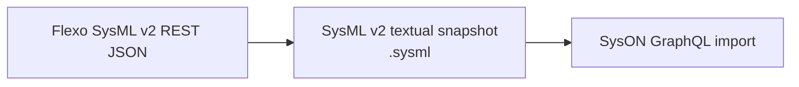
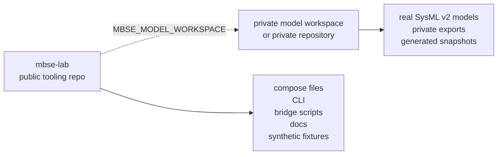

# SysML v2 Local Lab Kit

[](https://github.com/cosgroma/mbse-lab/community)
[](https://github.com/cosgroma/mbse-lab/actions/workflows/ci.yml)
[](https://github.com/cosgroma/mbse-lab/actions/workflows/documentation.yml)
[](LICENSE)
[](pyproject.toml)
[](https://github.com/cosgroma/mbse-lab)

This repo is a reusable local lab kit for starting SysML v2 work without making
this repo the home for the models themselves. It provides:

- OpenMBEE Flexo MMS as the graph-backed model repository and SysML v2 API service.
- Eclipse SysON as a graphical open-source SysML v2 editor.
- A bridge script that exports Flexo SysML v2 REST data, renders a `.sysml`
  textual snapshot, and imports it into SysON.

The current integration path is intentionally file/text based:



SysON and Flexo are separate repository stacks. Treat Flexo as the durable
repository path for API-driven experiments, and use SysON for graphical review or
editing of imported SysML v2 textual content.

## Five-Minute Quickstart

From a fresh checkout, use the CLI-first path and keep generated model artifacts
outside this tooling repo:

```bash
make install-cli
mbse-lab bootstrap --dry-run --model-workspace ~/work/my-private-models
mbse-lab bootstrap --model-workspace ~/work/my-private-models
export MBSE_MODEL_WORKSPACE=~/work/my-private-models
mbse-lab smoke first-use --json-output
mbse-lab share-check
```

Expected result: bootstrap prints the local Flexo and SysON URLs, the smoke
workflow reports `"status": "passed"` with Flexo/SysON IDs and generated
artifact paths under `$MBSE_MODEL_WORKSPACE/exports/`, and `share-check` passes.
Use `mbse-lab first-model "My First Model"` when you want to create just the
example model without the full smoke workflow.

## Which Command Should I Run?

| Goal | Primary command | Notes |
| --- | --- | --- |
| Install the CLI | `make install-cli` | Then run `mbse-lab --help`. |
| First setup | `mbse-lab bootstrap --model-workspace ~/work/my-private-models` | Creates env files, starts services, waits for readiness, and prints next steps. |
| Preview first setup | `mbse-lab bootstrap --dry-run --model-workspace ~/work/my-private-models` | No files, containers, or projects are changed. |
| Check environment | `mbse-lab doctor` | Use `mbse-lab doctor --fix` for low-risk local fixes. |
| Start services | `mbse-lab services up` | Waits for selected service APIs by default. |
| Stop services | `mbse-lab services down` | Keeps persisted service data. |
| Create demo model | `mbse-lab first-model "My First Model"` | Creates one Flexo project and imports it into SysON. |
| Prove first-use path | `mbse-lab smoke first-use --json-output` | Starts services, creates/imports a disposable model, and writes a report. |
| Bridge existing model | `mbse-lab bridge run <flexo-project-id> --create-syson-project "Imported From Flexo"` | Creates a SysON review project and imports into its root package. |
| Collect diagnostics | `mbse-lab diagnostics` | Use after service failures. |
| Generate report | `mbse-lab report` | Writes Markdown, HTML, and JSON under `reports/latest/`. |
| Clean generated local output | `mbse-lab cleanup --dry-run` | Remove reports, diagnostics, runs, and temp output after previewing. |
| Before sharing | `mbse-lab share-check` | Blocks common private data and credential leaks. |

Direct `python3 scripts/...` and `docker compose ...` commands remain available
for advanced inspection and manual recovery. Prefer `mbse-lab` commands for
routine setup, service lifecycle, bridge, diagnostics, and safety checks.

## Tooling Repo, Not Model Repo

Use this repo for the container deployment, setup scripts, bridge workflow,
diagnostics, documentation, and public synthetic fixtures. Keep real SysML v2
models in a separate private workspace or private repository.

Recommended layout:



```text
~/work/sysmlv2-lab/             this shared tooling repo
~/work/my-private-models/       private model workspace or private repo
```

Set `MBSE_MODEL_WORKSPACE` when you want generated bridge artifacts to default
outside this repo:

```bash
export MBSE_MODEL_WORKSPACE=~/work/my-private-models
```

With that variable set, `flexo-export`, `render-sysml`, and `flexo-to-syson`
write generated artifacts under `$MBSE_MODEL_WORKSPACE/exports/` unless you pass
explicit `--output` or `--output-dir` paths. See the
[private model workspace guide](docs/user-guide/private-model-workspaces.md) for
the full boundary.

## Layout

| Path | Purpose |
| --- | --- |
| [deploy/flexo-mms/](deploy/flexo-mms/README.md) | Flexo MMS Docker Compose environment. |
| [deploy/syson/](deploy/syson/README.md) | SysON Docker Compose environment. |
| [deploy/view-editor/](deploy/view-editor/README.md) | Experimental OpenMBEE View Editor compatibility probe. |
| [deploy/view-editor-5/](deploy/view-editor-5/README.md) | Experimental source-built View Editor 5.x compatibility probe. |
| [docs/index.md](docs/index.md) | Documentation landing page and task router. |
| [docs/user-guide/](docs/user-guide/cli.md) | CLI, services, safety, troubleshooting, release, and private workspace guidance. |
| [docs/lab/](docs/lab/flexo-syson-bridge.md) | Local lab operations, bridge behavior, and harness notes. |
| [docs/lab/view-editor-flexo-experiment.md](docs/lab/view-editor-flexo-experiment.md) | View Editor compatibility evidence. |
| [docs/methodology/](docs/methodology/sysml-v2-verification-model-setup.md) | Reusable SysML v2 setup and transformation guidance. |
| [docs/model-specs/](docs/model-specs/rf-link-budget.md) | General-purpose model specifications. |
| [docs/plans/](docs/plans/README.md) | Active and completed execution plans. |
| [exports/](exports/README.md) | Curated publishable example exports only. |
| [WORKFLOW.md](WORKFLOW.md) | Repo-owned workflow contract for agent work. |
| `scripts/flexo_mms_env.py` | Flexo environment manager. |
| `scripts/flexo_syson_bridge.py` | Flexo/SysON bridge and helper CLI. |

## Requirements

- Docker with the Compose plugin
- Python 3.10+
- Hatch for reproducible Python tooling and MkDocs environments
- `curl` and `jq` are useful for inspection, but not required by the Python
  scripts

No Python packages are required for the scripts; they use the standard library.

## First Model

After setup, create a tiny end-to-end model:

```bash
mbse-lab first-model "My First Model"
```

That command creates a Flexo project, commits one root package, exports and
renders a textual SysML snapshot, creates a SysON review project, imports the
snapshot, and prints IDs plus artifact paths.

For a disposable proof of first-use setup, run:

```bash
mbse-lab smoke first-use --json-output
```

## Bridge Scope

Routine bridge operations are available through the CLI:

```bash
mbse-lab flexo list
mbse-lab bridge run <flexo-project-id> \
  --create-syson-project "Imported From Flexo" \
  --json-output
```

The bridge renderer currently emits a practical subset of SysML v2 packages,
parts, attributes, ports, requirements, connections, interfaces, actions, and
items. Unsupported element types remain preserved in the Flexo JSON export but
are not emitted into the textual `.sysml` file yet. Diagram layout and live
repository sync are not round-tripped.

See the [bridge workflow](docs/lab/flexo-syson-bridge.md) for the full command
sequence, artifact table, render coverage report, and existing-project import
options.

## Safety Boundary

Before sharing or publishing the tooling repo, run:

```bash
mbse-lab share-check
```

Keep real model data in a private workspace:

```bash
export MBSE_MODEL_WORKSPACE=~/work/my-private-models
```

Runtime env files, service databases, private exports, run logs, reports, and
diagnostics are local artifacts. The [safety and sharing
guide](docs/user-guide/safety-and-sharing.md) documents what is ignored, what
may be published, and how to clean generated output.

## Documentation

| Need | Page |
| --- | --- |
| Install and use the CLI | [CLI guide](docs/user-guide/cli.md) |
| Inspect every command and option | [CLI reference](docs/user-guide/cli-reference.md) |
| Start, stop, and inspect services | [Services](docs/user-guide/services.md) |
| Keep model data private | [Private model workspaces](docs/user-guide/private-model-workspaces.md) |
| Share safely | [Safety and sharing](docs/user-guide/safety-and-sharing.md) |
| Recover from common failures | [Troubleshooting](docs/user-guide/troubleshooting.md) |
| Run Flexo-to-SysON bridge workflows | [Bridge workflow](docs/lab/flexo-syson-bridge.md) |
| Prepare a release | [Release process](docs/user-guide/release-process.md) |

Build the MkDocs site:

```bash
make docs-build
```

Serve it locally while editing:

```bash
make docs-serve
```
