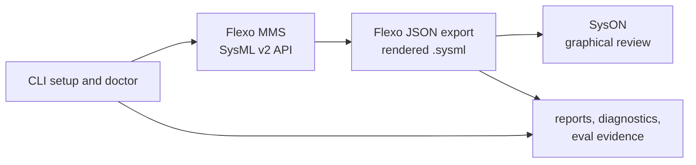

# SysML v2 Local Lab Documentation

This documentation set supports the shareable SysML v2 local lab kit, private
model workspace usage, SysML v2 modeling guidance, and publishable model
specifications.

## Start Here

| Goal | Start with | Then use |
| --- | --- | --- |
| Install and operate the lab CLI | [CLI](user-guide/cli.md) | [CLI Reference](user-guide/cli-reference.md) |
| Start, stop, or inspect services | [Services](user-guide/services.md) | [Troubleshooting](user-guide/troubleshooting.md) |
| Keep private model data out of the tooling repo | [Private Model Workspaces](user-guide/private-model-workspaces.md) | [Safety And Sharing](user-guide/safety-and-sharing.md) |
| Move a Flexo model snapshot into SysON | [Bridge Workflow](lab/flexo-syson-bridge.md) | [Transformation Pipeline](methodology/sysml-v2-transformation-pipeline-design.md) |
| Understand supported rendered SysML v2 content | [Modeling Conventions](lab/modeling-conventions.md) | [Bridge Workflow](lab/flexo-syson-bridge.md) |
| Prepare or publish a release | [Release Process](user-guide/release-process.md) | [v0.2.0 Limitations](user-guide/v0.2.0-limitations.md) |
| Extend the local harness or evals | [Harness Engineering](lab/harness-engineering.md) | [Plans](plans/README.md) |
| Plan roadmap or feature work | [Roadmap](roadmap.md) | [Feature Proposals](plans/proposals/README.md) |

## Which Command Should I Run?

| Goal | Command |
| --- | --- |
| Install the CLI | `make install-cli` |
| First setup | `mbse-lab bootstrap --model-workspace ~/work/my-private-models` |
| Check environment | `mbse-lab doctor` |
| Start services | `mbse-lab services up` |
| Create demo model | `mbse-lab first-model "My First Model"` |
| Prove first-use path | `mbse-lab smoke first-use --json-output` |
| Bridge existing model | `mbse-lab bridge run <flexo-project-id> --create-syson-project "Imported From Flexo"` |
| Collect diagnostics | `mbse-lab diagnostics` |
| Generate report | `mbse-lab report` |
| Clean generated local output | `mbse-lab cleanup --dry-run` |
| Before sharing | `mbse-lab share-check` |

Use the `mbse-lab` command surface for routine work. Direct script and Docker
commands are advanced/manual recovery paths in the deployment and bridge pages.

## Local Lab Flow

## User Guide

| Page | Use it for |
| --- | --- |
| [Private Model Workspaces](user-guide/private-model-workspaces.md) | Separating reusable tooling from private SysML v2 source, exports, run logs, and service data. |
| [CLI](user-guide/cli.md) | Installing `mbse-lab`, running doctor/bootstrap, managing services, creating a first model, and using bridge commands. |
| [CLI Reference](user-guide/cli-reference.md) | Generated command and option reference built from the Click command tree. |
| [Services](user-guide/services.md) | Starting, stopping, checking, and maintaining the local Flexo and SysON services. |
| [Safety And Sharing](user-guide/safety-and-sharing.md) | Credential, service-data, private-workspace, share-check, report, and cleanup boundaries. |
| [Troubleshooting](user-guide/troubleshooting.md) | Symptom-oriented recovery paths for Docker, ports, Flexo org setup, SysON startup, and bridge imports. |
| [Release Process](user-guide/release-process.md) | Preparing release branches, smoke testing, tagging, and syncing release work back to `develop`. |
| [v0.2.0 Limitations](user-guide/v0.2.0-limitations.md) | Tracking release-scope limits, known gaps, and downstream development focus areas. |

## Roadmap

| Page | Use it for |
| --- | --- |
| [Roadmap](roadmap.md) | Maintaining Now/Next/Later priorities, roadmap themes, out-of-scope boundaries, and planning gates. |

## Local Lab

| Page | Use it for |
| --- | --- |
| [Bridge Workflow](lab/flexo-syson-bridge.md) | Exporting from Flexo, rendering textual SysML v2, and importing into SysON. |
| [Harness Engineering](lab/harness-engineering.md) | Understanding command surfaces, guardrails, evals, diagnostics, and agent-oriented operating rules. |
| [Feature Development Agent Prompt](lab/feature-development-agent-prompt.md) | Copyable fresh-agent prompt for proposal-backed feature implementation. |
| [Modeling Conventions](lab/modeling-conventions.md) | Checking which Flexo element types are rendered into textual SysML v2 and how names are sanitized. |
| [View Editor Flexo Experiment](lab/view-editor-flexo-experiment.md) | Final compatibility report and request evidence for the experimental OpenMBEE View Editor deployments. |

## Methodology

| Page | Use it for |
| --- | --- |
| [Verification Model Setup](methodology/sysml-v2-verification-model-setup.md) | Organizing SysML v2 packages, requirements, architecture, configurations, analysis, and verification content. |
| [Transformation Pipeline](methodology/sysml-v2-transformation-pipeline-design.md) | Designing model-to-analysis, model-to-document, and evidence import pipelines around SysML v2 source content. |

## Model Specs

| Page | Use it for |
| --- | --- |
| [MBSE Lab Tool System](model-specs/mbse-lab-tool-system.md) | Modeling this repo's own requirements, architecture, workflows, verification concepts, and rendered fixture artifacts. |
| [RF Link Budget](model-specs/rf-link-budget.md) | Modeling RF link margin, budget equations, requirements, analysis cases, and verification evidence. |
| [CCA Rollup](model-specs/cca-rollup.md) | Modeling circuit-card power, mass, cost, labor, test, and rollup verification. |
| [RF to Digital Signal Chain](model-specs/rf-to-digital-signal-chain.md) | Modeling RF front-end, ADC, DSP, signal quality, and response artifacts. |
| [Container Deployment](model-specs/container-deployment.md) | Modeling container services, ports, volumes, health checks, persistence, backup, and runtime verification. |
| [Security Architecture](model-specs/security-architecture.md) | Modeling security assets, enclaves, controls, risks, mitigations, and evidence records. |
| [Enterprise Architecture](model-specs/enterprise-architecture.md) | Modeling capabilities, activities, services, resources, projects, and enterprise traceability. |

## Plans

| Page | Use it for |
| --- | --- |
| [Plans](plans/README.md) | Feature proposal and execution plan conventions for planned, active, and completed work. |
| [Feature Proposals](plans/proposals/README.md) | Deciding feature shape, non-goals, validation, and safety impact before implementation starts. |
| [Feature Pre-Plan Template](plans/proposals/feature-preplan-template.md) | Copyable proposal template for roadmap-changing or risk-bearing feature work. |
| [Backup-First Reset Workflow](plans/proposals/backup-first-reset-workflow.md) | Proposed safe reset workflow with backup, dry-run, and confirmation gates. |
| [Bridge Import Preflight](plans/proposals/bridge-import-preflight.md) | Proposed pre-import checks for snapshot quality, render coverage, and target context. |
| [Bridge Snapshot Diff](plans/proposals/bridge-snapshot-diff.md) | Proposed comparison workflow for bridge snapshots, rendered text, and render reports. |
| [Environment Profiles](plans/proposals/environment-profiles.md) | Proposed named non-secret config profiles for advanced local and endpoint workflows. |
| [Model-Like JSON Share Check](plans/proposals/model-like-json-share-check.md) | Proposed share-check heuristic for tracked Flexo/SysML-looking JSON. |
| [Optional SysML v2 Starter Libraries](plans/proposals/optional-sysml-v2-starter-libraries.md) | Proposed public starter library catalog for optional model scaffolding. |
| [Polished HTML Report](plans/proposals/polished-html-report.md) | Proposed structured static HTML report for workflow evidence. |
| [Snapshot Evidence Bundle](plans/proposals/snapshot-evidence-bundle.md) | Proposed public-safe evidence bundle for bridge run handoffs. |
| [SysML Coverage Matrix Gate](plans/proposals/sysml-coverage-matrix-gate.md) | Proposed bridge coverage matrix tied to fixtures and deterministic tests. |
| [MVP Feature Catalog](plans/active/mvp-feature-catalog.md) | Current MVP feature status, evidence, gaps, and validation work. |
| [Usability Remediation](plans/active/usability-remediation.md) | Active work plan for converting the usability review into validated safety, onboarding, and bridge improvements. |
| [SysML JSON Rendering Reuse Spike](plans/active/sysml-json-rendering-reuse-spike.md) | Active spike on reuse options for SysML JSON rendering and import workflows. |
| [View Editor Flexo Experiment](plans/completed/openmbee-view-editor-flexo-experiment.md) | Completed direct-compatibility spike and final adapter decision. |
| [MBSE Lab SysML Model](plans/active/mbse-lab-sysml-model-plan.md) | Active plan for keeping the lab tool-system model, fixture, and curated render output aligned. |

## Reviews

| Page | Use it for |
| --- | --- |
| [Usability Review](reviews/usability-review.md) | Static usability assessment and prioritized findings for the local lab kit. |
| [Recommended Features Review](reviews/recommended-features.md) | Product direction, capability map, milestone recommendations, and feature backlog for the local lab kit. |
| [Recommended Sprint Sequence](reviews/recommended-sprints.md) | Sprint sequencing, acceptance gates, project-board fields, and dependency map for near-term execution. |
