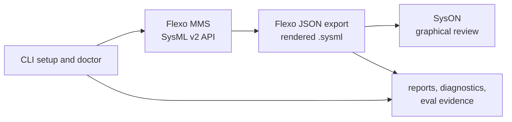

# SysML v2 Local Lab Documentation

This documentation set supports the shareable SysML v2 local lab kit, private
model workspace usage, SysML v2 modeling guidance, and publishable model
specifications.

## Start Here

| Goal | Start with | Then use |
| --- | --- | --- |
| Install and operate the lab CLI | [CLI](user-guide/cli.md) | [Bridge Workflow](lab/flexo-syson-bridge.md) |
| Keep private model data out of the tooling repo | [Private Model Workspaces](user-guide/private-model-workspaces.md) | [Modeling Conventions](lab/modeling-conventions.md) |
| Move a Flexo model snapshot into SysON | [Bridge Workflow](lab/flexo-syson-bridge.md) | [Transformation Pipeline](methodology/sysml-v2-transformation-pipeline-design.md) |
| Understand supported rendered SysML v2 content | [Modeling Conventions](lab/modeling-conventions.md) | [Bridge Workflow](lab/flexo-syson-bridge.md) |
| Prepare or publish a release | [Release Process](user-guide/release-process.md) | [MVP Feature Catalog](plans/active/mvp-feature-catalog.md) |
| Extend the local harness or evals | [Harness Engineering](lab/harness-engineering.md) | [Plans](plans/README.md) |

## Local Lab Flow

## User Guide

| Page | Use it for |
| --- | --- |
| [Private Model Workspaces](user-guide/private-model-workspaces.md) | Separating reusable tooling from private SysML v2 source, exports, run logs, and service data. |
| [CLI](user-guide/cli.md) | Installing `mbse-lab`, running doctor/bootstrap, managing services, creating a first model, and using bridge commands. |
| [Release Process](user-guide/release-process.md) | Preparing release branches, smoke testing, tagging, and syncing release work back to `develop`. |

## Local Lab

| Page | Use it for |
| --- | --- |
| [Bridge Workflow](lab/flexo-syson-bridge.md) | Exporting from Flexo, rendering textual SysML v2, and importing into SysON. |
| [Harness Engineering](lab/harness-engineering.md) | Understanding command surfaces, guardrails, evals, diagnostics, and agent-oriented operating rules. |
| [Modeling Conventions](lab/modeling-conventions.md) | Checking which Flexo element types are rendered into textual SysML v2 and how names are sanitized. |
| [View Editor Flexo Experiment](lab/view-editor-flexo-experiment.md) | Final compatibility report and request evidence for the experimental OpenMBEE View Editor deployments. |

## Methodology

| Page | Use it for |
| --- | --- |
| [Verification Model Setup](methodology/sysml-v2-verification-model-setup.md) | Organizing SysML v2 packages, requirements, architecture, configurations, analysis, and verification content. |
| [Transformation Pipeline](methodology/sysml-v2-transformation-pipeline-design.md) | Designing model-to-analysis, model-to-document, and evidence import pipelines around SysML v2 source content. |

## Model Specs

| Page | Use it for |
| --- | --- |
| [RF Link Budget](model-specs/rf-link-budget.md) | Modeling RF link margin, budget equations, requirements, analysis cases, and verification evidence. |
| [CCA Rollup](model-specs/cca-rollup.md) | Modeling circuit-card power, mass, cost, labor, test, and rollup verification. |
| [RF to Digital Signal Chain](model-specs/rf-to-digital-signal-chain.md) | Modeling RF front-end, ADC, DSP, signal quality, and response artifacts. |
| [Container Deployment](model-specs/container-deployment.md) | Modeling container services, ports, volumes, health checks, persistence, backup, and runtime verification. |
| [Security Architecture](model-specs/security-architecture.md) | Modeling security assets, enclaves, controls, risks, mitigations, and evidence records. |
| [Enterprise Architecture](model-specs/enterprise-architecture.md) | Modeling capabilities, activities, services, resources, projects, and enterprise traceability. |

## Plans

| Page | Use it for |
| --- | --- |
| [Plans](plans/README.md) | Execution plan conventions for active and completed work. |
| [MVP Feature Catalog](plans/active/mvp-feature-catalog.md) | Current MVP feature status, evidence, gaps, and validation work. |
| [Usability Remediation](plans/active/usability-remediation.md) | Active work plan for converting the usability review into validated safety, onboarding, and bridge improvements. |
| [View Editor Flexo Experiment](plans/completed/openmbee-view-editor-flexo-experiment.md) | Completed direct-compatibility spike and final adapter decision. |

## Reviews

| Page | Use it for |
| --- | --- |
| [Usability Review](reviews/usability-review.md) | Static usability assessment and prioritized findings for the local lab kit. |
| [Recommended Features Review](reviews/recommended-features.md) | Product direction, capability map, milestone recommendations, and feature backlog for the local lab kit. |
