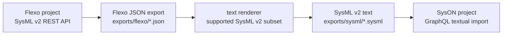

# Flexo to SysON Bridge

This is the initial bridge path:



The script is intentionally conservative. It preserves the Flexo JSON export and
renders a supported subset of SysML v2 textual notation for import into SysON.

## Private Model Workspaces

This repo is the shared tooling repo. Real model data should normally live in a
separate private workspace or private repository.

Set `MBSE_MODEL_WORKSPACE` before generating artifacts:

```bash
export MBSE_MODEL_WORKSPACE=~/work/my-private-models
```

When set, `flexo-export`, `render-sysml`, and `flexo-to-syson` default generated
artifacts to:

```text
$MBSE_MODEL_WORKSPACE/exports/
```

Use explicit `--output` or `--output-dir` paths when a run needs a different
location. The canonical boundary is documented in
[Private Model Workspaces](../user-guide/private-model-workspaces.md).

## Preflight

Make sure both stacks are running:

```bash
python3 scripts/flexo_mms_env.py status --with-sysmlv2
docker compose -f deploy/syson/docker-compose.yml ps
```

Initialize the Flexo org used by the SysML v2 service if project creation fails
with `Org <http://layer1-service/orgs/sysmlv2> does not exist`:

```bash
python3 scripts/flexo_syson_bridge.py init-flexo-org
python3 scripts/flexo_mms_env.py backup
```

The backup matters because the local Fuseki container starts from
`deploy/flexo-mms/mount/cluster.trig`.

| Check | Command | Expected signal |
| --- | --- | --- |
| Flexo status | `python3 scripts/flexo_mms_env.py status --with-sysmlv2` | Flexo containers and SysML v2 service are reachable. |
| SysON status | `docker compose -f deploy/syson/docker-compose.yml ps` | SysON application and database containers are running. |
| Flexo org exists | `python3 scripts/flexo_syson_bridge.py init-flexo-org` | Needed only when project creation reports the missing `sysmlv2` org. |
| Graph seed is current | `python3 scripts/flexo_mms_env.py backup` | `deploy/flexo-mms/mount/cluster.trig` reflects org/setup changes. |

## Flexo Commands

| Task | CLI command | Script command |
| --- | --- | --- |
| List projects | `mbse-lab flexo list` | `python3 scripts/flexo_syson_bridge.py flexo-list-projects` |
| Create project | `mbse-lab flexo create "Example Model"` | `python3 scripts/flexo_syson_bridge.py flexo-create-project "Example Model"` |
| Export JSON | `mbse-lab flexo export <flexo-project-id>` | `python3 scripts/flexo_syson_bridge.py flexo-export <flexo-project-id>` |
| Render SysML text | `mbse-lab bridge render exports/flexo/<flexo-project-id>.json` | `python3 scripts/flexo_syson_bridge.py render-sysml exports/flexo/<flexo-project-id>.json` |

## SysON Commands

| Task | CLI command | Script command |
| --- | --- | --- |
| Create project | `mbse-lab syson create "Imported From Flexo"` | `python3 scripts/flexo_syson_bridge.py syson-create-project "Imported From Flexo"` |
| Find import namespace | `mbse-lab syson roots <syson-project-id>` | `python3 scripts/flexo_syson_bridge.py syson-roots <syson-project-id>` |
| Import SysML text | `mbse-lab bridge import exports/sysml/<flexo-project-id>.sysml --project-id <syson-project-id> --namespace-id <syson-root-package-id>` | `python3 scripts/flexo_syson_bridge.py syson-import-text exports/sysml/<flexo-project-id>.sysml --project-id <syson-project-id> --namespace-id <syson-root-package-id>` |
| Run full pipeline | `mbse-lab bridge run <flexo-project-id> --syson-project-id <syson-project-id> --namespace-id <syson-root-package-id>` | `python3 scripts/flexo_syson_bridge.py flexo-to-syson <flexo-project-id> --syson-project-id <syson-project-id> --namespace-id <syson-root-package-id>` |

For the full pipeline, the expanded script form is:

```bash
python3 scripts/flexo_syson_bridge.py flexo-to-syson <flexo-project-id> \
  --syson-project-id <syson-project-id> \
  --namespace-id <syson-root-package-id>
```

## Artifacts

| Artifact | Default location | Share guidance |
| --- | --- | --- |
| Flexo JSON export | `exports/flexo/<flexo-project-id>.json` | Keep private unless the model is synthetic and publishable. |
| Rendered SysML text | `exports/sysml/<flexo-project-id>.sysml` | Derived from the export; keep private for real models. |
| Full-pipeline run log | `runs/flexo-to-syson/` | Ignored by git; may include private project IDs and names. |
| Private workspace exports | `$MBSE_MODEL_WORKSPACE/exports/` | Preferred location for real model bridge artifacts. |

## Current Scope

The renderer currently handles a practical subset:

- `Package`
- `PartDefinition`
- `PartUsage`
- `AttributeUsage`
- `PortUsage`
- `RequirementDefinition`
- `RequirementUsage`
- `ConnectionDefinition`
- `ConnectionUsage`
- `InterfaceDefinition`
- `InterfaceUsage`
- `ActionDefinition`
- `ActionUsage`
- `ItemDefinition`
- `ItemUsage`

Unsupported element types remain in the raw Flexo JSON export but are not emitted
into the textual `.sysml` file yet.

## Related Docs

| Page | Why it matters |
| --- | --- |
| [CLI](../user-guide/cli.md) | Describes the user-facing `mbse-lab bridge`, `flexo`, and `syson` commands. |
| [Private Model Workspaces](../user-guide/private-model-workspaces.md) | Defines where generated model artifacts should live. |
| [Modeling Conventions](modeling-conventions.md) | Lists supported rendered element types and naming rules. |
| [Transformation Pipeline](../methodology/sysml-v2-transformation-pipeline-design.md) | Places the bridge in the broader model transformation strategy. |
