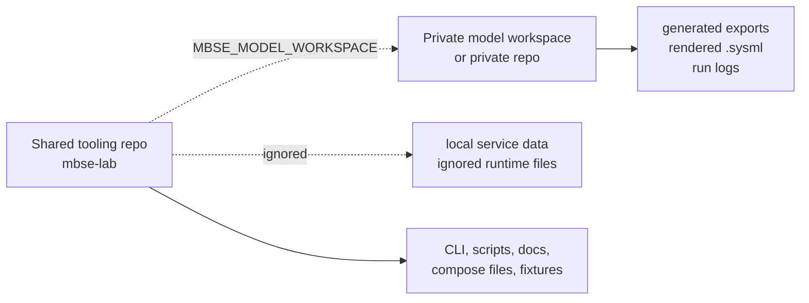

# Private Model Workspaces

This repo is intended to be shared as a SysML v2 local lab kit. It should hold
the reusable tooling needed to run OpenMBEE Flexo MMS, Eclipse SysON, the bridge
workflow, diagnostics, and public fixtures. It should not become the long-term
home for private system models.

## Recommended Layout

Use separate directories for tooling and model data:



Keep this repo public or broadly shared. Keep real program, customer, product,
or system models in the private workspace.

| Location | Example | Contents |
| --- | --- | --- |
| Shared tooling repo | `~/work/sysmlv2-lab/` | Compose files, CLI, bridge scripts, docs, synthetic fixtures. |
| Private model workspace | `~/work/my-private-models/` | Real model source, private exports, rendered snapshots, run evidence. |

## What Belongs In This Repo

| Belongs here | Belongs outside this repo |
| --- | --- |
| Docker Compose files for Flexo and SysON. | Real `.sysml` model source. |
| Runtime setup, status, backup, diagnostics, and bridge scripts. | Flexo JSON exports from private projects. |
| Publishable `.env.example` files. | Rendered SysML snapshots from private projects. |
| Public synthetic fixtures and examples. | SysON database contents. |
| Documentation for operating the local lab. | Flexo backup files that include private graph state. |
|  | Run logs that include private project IDs, names, or import details. |
|  | Runtime credentials and local `.env` files. |

## Workspace Environment Variable

Set `MBSE_MODEL_WORKSPACE` before running bridge commands that generate model
artifacts:

```bash
export MBSE_MODEL_WORKSPACE=~/work/my-private-models
```

When this variable is set, bridge commands that do not receive explicit output
paths write generated artifacts under:

```text
$MBSE_MODEL_WORKSPACE/exports/
```

When this variable is unset and no explicit output path is provided,
model-generating commands fall back to repo-local `exports/` and print a
warning. Use that fallback only for synthetic, publishable examples or local
scratch work that will not be shared.

For example:

```bash
python3 scripts/flexo_syson_bridge.py flexo-export <flexo-project-id>
python3 scripts/flexo_syson_bridge.py render-sysml \
  ~/work/my-private-models/exports/flexo/<flexo-project-id>.json
```

The full bridge also respects the workspace default:

```bash
python3 scripts/flexo_syson_bridge.py flexo-to-syson <flexo-project-id> \
  --syson-project-id <syson-project-id> \
  --namespace-id <syson-root-package-id>
```

You can still override paths explicitly for one-off runs:

```bash
python3 scripts/flexo_syson_bridge.py flexo-export <flexo-project-id> \
  --output ~/work/my-private-models/exports/flexo/model.json
python3 scripts/flexo_syson_bridge.py render-sysml \
  ~/work/my-private-models/exports/flexo/model.json \
  --output ~/work/my-private-models/exports/sysml/model.sysml
```

## Sharing Safely

Before publishing or handing off this repo, run:

```bash
make check
```

That includes the tracked secret scan and confirms the deterministic bridge
evals still pass. It does not inspect private model workspaces, so review those
separately before sharing them.

## Related Docs

| Page | Why it matters |
| --- | --- |
| [CLI](cli.md) | Provides `mbse-lab workspace`, `bootstrap`, `doctor`, and `share-check` commands. |
| [Bridge Workflow](../lab/flexo-syson-bridge.md) | Shows how generated Flexo and SysON artifacts flow through the private workspace boundary. |
| [Harness Engineering](../lab/harness-engineering.md) | Documents diagnostics, run logs, evals, and share-safety guardrails. |
